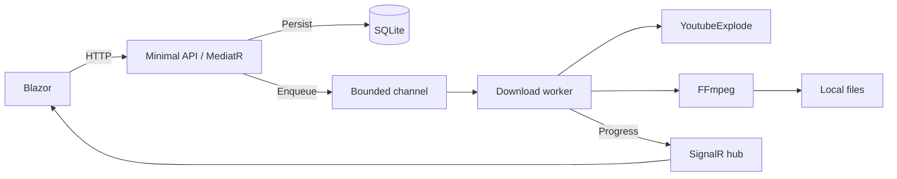

# YtDownloader

A personal media converter built with .NET 10 and Blazor. Paste a YouTube video
link, choose MP4 or MP3 and a quality, then follow the download's progress.

## Features

- Video metadata and thumbnail previews.
- Selectable MP4 resolutions and MP3 bitrates (128k, 192k, 320k).
- Video thumbnail embedded as MP3 cover art.
- Background processing with a bounded queue and configurable concurrency.
- Live SignalR progress with HTTP polling when the connection drops.
- SQLite persistence and recovery of interrupted jobs after restart.
- Automatic file expiration and cleanup.
- Browser-local history of the 20 most recent jobs.
- Responsive interface, loading states, and actionable error messages.
- Minimal API endpoints, ProblemDetails, rate limits, and Scalar API documentation.

## Stack

| Area | Technologies |
| --- | --- |
| Runtime | .NET 10, C# |
| UI | Blazor Web App, interactive server rendering |
| API | ASP.NET Core Minimal APIs, SignalR, OpenAPI, Scalar, Serilog |
| Application | MediatR, FluentValidation, Result pattern |
| Persistence | EF Core, SQLite |
| Media | YoutubeExplode, FFmpeg, CliWrap |
| Tests | xUnit, NSubstitute, WebApplicationFactory, Node's built-in test runner |

## Getting started

### Requirements

- .NET 10 SDK.
- FFmpeg and FFprobe installed; run `ffmpeg -version` to verify.
- Internet access from the API process to YouTube.
- Node.js 22 or later for the optional browser-storage tests.

### Run locally

From the repository root:

```powershell
dotnet restore YtDownloader.sln
dotnet build YtDownloader.sln
```

Start the API in one terminal:

```powershell
dotnet run --project src/YtDownloader.Api --launch-profile http
```

Start Blazor in another terminal:

```powershell
dotnet run --project src/YtDownloader.Web --launch-profile http
```

Open [the app](http://localhost:5147).
The API runs at [localhost:5039](http://localhost:5039), with
[Scalar](http://localhost:5039/scalar/v1) and a [health endpoint](http://localhost:5039/health).
The database is created and migrated automatically on API startup.

In Visual Studio, run both **YtDownloader.Api** and **YtDownloader.Web**. Each
needs its own port; stop a previous instance before launching another.
Stop an app started from `bin/Debug` before rebuilding it on Windows.

### Configure FFmpeg

By default, the API looks for `ffmpeg` on PATH. If it is installed elsewhere,
set its path in the API terminal before starting the API:

```powershell
$env:Ffmpeg__Path = "C:\path\to\ffmpeg.exe"
dotnet run --project src/YtDownloader.Api --launch-profile http
```

Alternatively, create `src/YtDownloader.Api/appsettings.Local.json`:

```json
{
  "Ffmpeg": {
    "Path": "C:/path/to/ffmpeg.exe"
  }
}
```

That file is ignored by Git, loaded only in Development, and excluded from
published output. Environment variables and command-line settings override it.
FFmpeg executables, database files, and downloaded media are not included in the repository.

## Configuration

| Setting | Default |
| --- | --- |
| `Media:MaxVideoDurationMinutes` | 120 |
| `Media:FileRetentionMinutes` | 30 |
| `DownloadWorker:MaxParallelJobs` | 2 |
| `JobQueue:Capacity` | 100 |
| `Api:RateLimitPermitLimit` | 30 requests per IP |
| `Api:RateLimitWindowSeconds` | 60 |
| `Api:MaxRequestBodyBytes` | 16384 |
| `ConnectionStrings:Jobs` | Data Source=YtDownloader.db |
| Web `Api:BaseUrl` in Development | http://localhost:5039/ |

Configuration uses standard .NET appsettings and environment variables. Replace
`:` with `__` for environment variable names. See [API details](src/YtDownloader.Api/README.md).

## Architecture

```text
src/
  YtDownloader.Domain          Entities and status-transition invariants
  YtDownloader.Application     Use cases, DTOs, validation, and interfaces
  YtDownloader.Infrastructure  SQLite, YouTube, FFmpeg, storage, and channel queue
  YtDownloader.Api             HTTP endpoints, hosted workers, and SignalR hub
  YtDownloader.Web             UI and HTTP/SignalR clients
tests/
  YtDownloader.Domain.UnitTests
  YtDownloader.Application.UnitTests
  YtDownloader.Infrastructure.Tests
  YtDownloader.Api.IntegrationTests
  YtDownloader.Web.Tests       JavaScript browser-storage tests
```

Dependencies point inward. Domain has no project dependencies. Application
references Domain; Infrastructure references Application. The API composes them.
Blazor communicates with the API over HTTP and SignalR without referencing backend projects.



## Verification

```powershell
dotnet build YtDownloader.sln
dotnet test YtDownloader.sln
node --test tests/YtDownloader.Web.Tests/jobHistory.test.mjs
```

The default .NET suite uses isolated SQLite databases and substitutes for external
YouTube calls. Live YouTube and real FFmpeg tests are opt-in.

To test actual MP3 conversion, MP4 merging, and MP3 artwork:

```powershell
$env:YTDOWNLOADER_FFMPEG_TEST_PATH = "C:\path\to\ffmpeg.exe"
dotnet test tests/YtDownloader.Infrastructure.Tests --filter "Category=FFmpeg"
```

Keep `ffprobe.exe` alongside `ffmpeg.exe` for these checks.
For the live download test, see [integration test instructions](tests/YtDownloader.Infrastructure.Tests/README.md).
CI builds and runs the default .NET suite and browser-storage tests.

## Current scope

This is a personal, single-instance application. It supports individual videos
up to two hours, with temporary downloads retained for 30 minutes by default.
History belongs to the current browser; it is not an account system.

YouTube can reject anonymous requests with a sign-in/bot-check challenge. That is
an external service restriction; this app does not authenticate to YouTube.
FFmpeg must be installed separately. Use content you own or are authorized to download.

## Project showcase

- [Demo recording guide](docs/DEMO.md)
- [LinkedIn post draft](docs/LINKEDIN_POST.md)
- [Third-party assets](THIRD_PARTY_NOTICES.md)
